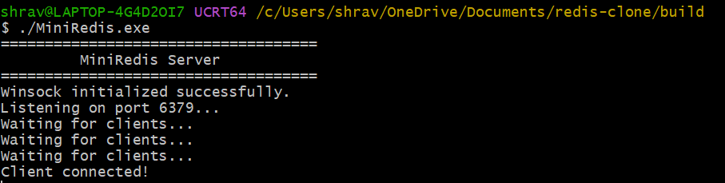
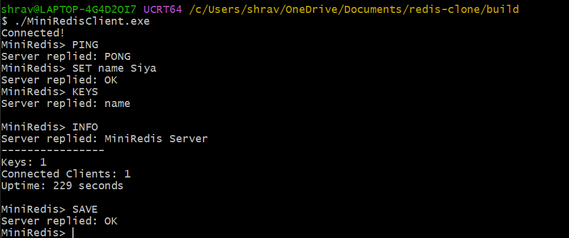
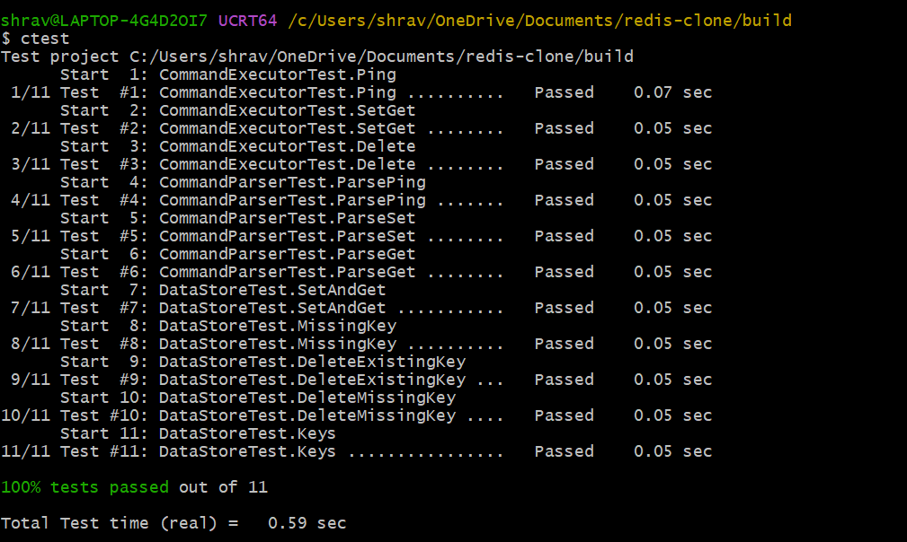
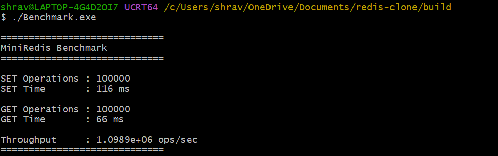
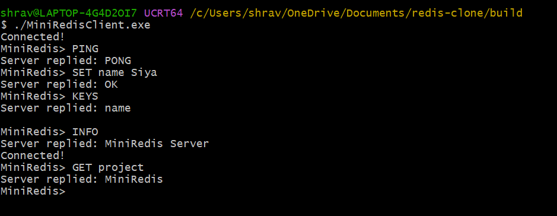
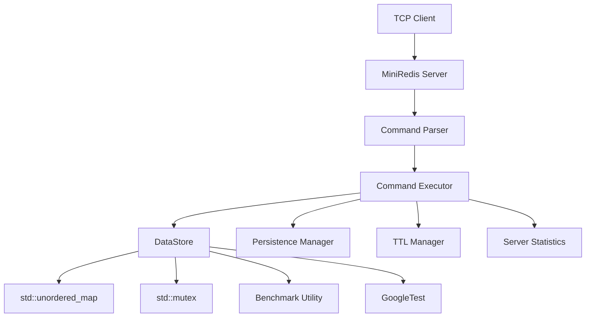

# MiniRedis

A multithreaded Redis-inspired in-memory key-value database server built in modern C++17 using TCP sockets, supporting concurrent clients, persistence, TTL expiration, authentication, benchmarking, and automated unit testing.


## Overview

MiniRedis is a lightweight Redis-inspired in-memory key-value database server developed in modern C++17 as a systems programming project. The project demonstrates the implementation of core database concepts including TCP networking, concurrent client handling, thread-safe data storage, persistence, authentication, and command parsing.

Unlike a simple key-value store, MiniRedis was designed with modularity and extensibility in mind. The server separates networking, command parsing, command execution, storage management, persistence, benchmarking, and testing into independent components, making the architecture easier to maintain and extend.

The project focuses on understanding how an in-memory database works internally rather than replicating every Redis feature. It showcases practical software engineering concepts such as multithreading, synchronization, socket programming, unit testing, and build automation using CMake.

## Features

### Networking

- TCP server built using Winsock
- Concurrent client connections
- Persistent client sessions
- Request/response communication model

### Database

- In-memory key-value storage
- Thread-safe operations using std::mutex
- Constant-time key lookup using std::unordered_map
- Key deletion
- Key enumeration

### Supported Commands

- PING
- SET
- GET
- DEL
- KEYS
- INFO
- AUTH
- SAVE
- LOAD

### Persistence

- Database serialization
- Automatic loading on server startup
- Manual save support

### Expiration

- TTL (Time-To-Live)
- Background cleanup thread
- Automatic expired key removal

### Monitoring

- Server statistics
- Connected clients
- Key count
- Server uptime

### Software Engineering

- Modular architecture
- GoogleTest unit tests
- Benchmark utility
- CMake build system

## Demo

### Server



### Client



### Unit Tests



### Benchmark



### Persistence



## Architecture



## Project Structure

```text
redis-clone/
│
├── include/               # Header files
│   ├── Server.h
│   ├── DataStore.h
│   ├── CommandParser.h
│   ├── CommandExecutor.h
│   ├── Persistence.h
│   ├── ServerStats.h
│   └── ClientSession.h
│
├── src/                   # Source files
│   ├── main.cpp
│   ├── Server.cpp
│   ├── Client.cpp
│   ├── DataStore.cpp
│   ├── CommandParser.cpp
│   ├── CommandExecutor.cpp
│   ├── Persistence.cpp
│   ├── ServerStats.cpp
│   ├── ClientSession.cpp
│   └── Benchmark.cpp
│
├── tests/                 # GoogleTest unit tests
│
├── CMakeLists.txt
├── README.md
└── .gitignore
```
## Supported Commands

| Command | Description | Example |
|----------|-------------|---------|
| PING | Test server connectivity | `PING` |
| SET | Store a key-value pair | `SET name Shravani` |
| GET | Retrieve a value | `GET name` |
| DEL | Delete a key | `DEL name` |
| KEYS | List all keys | `KEYS` |
| INFO | Display server statistics | `INFO` |
| AUTH | Authenticate a client | `AUTH password` |
| SAVE | Persist database to disk | `SAVE` |
| LOAD | Load persisted database | Automatically on startup |

## Building the Project

### Clone the Repository

```bash
git clone https://github.com/<your-username>/redis-clone.git
cd redis-clone
```

### Configure

```bash
cmake -B build
```

### Build

```bash
cmake --build build
```

## Running the Server

```bash
./build/MiniRedis
```

Expected output:

```text
====================================
         MiniRedis Server
====================================

Listening on port 6379...
Waiting for clients...
```
## Running the Client

```bash
./build/MiniRedisClient
```

Example session:

```text
MiniRedis> PING
PONG

MiniRedis> SET name Shravani
OK

MiniRedis> GET name
Shravani

MiniRedis> INFO

MiniRedis Server
----------------
Keys: 1
Connected Clients: 1
```

## Running Unit Tests

MiniRedis uses **GoogleTest** for automated testing.

Run:

```bash
ctest --test-dir build
```

Example output:

```text
100% tests passed, 11 tests passed out of 11
```
## Benchmark

The project includes a benchmarking utility for measuring database performance.

Run:

```bash
./build/Benchmark
```


## Technologies Used

| Category | Technology |
|----------|------------|
| Language | C++17 |
| Build System | CMake |
| Networking | Winsock2 |
| Threading | std::thread |
| Synchronization | std::mutex |
| Data Structure | std::unordered_map |
| Testing | GoogleTest |
| Benchmarking | C++ Chrono Library |
| Version Control | Git |
| Platform | Windows |

## Learning Outcomes

Building MiniRedis provided hands-on experience with several important systems programming concepts, including:

- TCP socket programming using Winsock
- Concurrent server design with multithreading
- Thread synchronization using mutexes
- Designing a modular software architecture
- Implementing an in-memory key-value database
- Building a custom command parser
- Database persistence techniques
- Time-To-Live (TTL) key expiration
- Unit testing using GoogleTest
- Performance benchmarking
- Managing C++ projects using CMake

The project strengthened my understanding of backend system design, concurrency, networking, and modern C++ development.

## Future Improvements

Potential enhancements include:

- Full RESP protocol compatibility
- Publish/Subscribe messaging
- Transaction support (MULTI / EXEC)
- Cross-platform socket implementation
- Docker support
- Configuration file support
- REST API for monitoring
- Memory optimization
- Advanced benchmarking
- GitHub Actions CI/CD

## License

This project is released under the MIT License.

## Acknowledgements

This project was inspired by Redis and was built as a learning project to understand the internal architecture of in-memory databases, concurrent server design, and modern C++ systems programming.

## Author

**Shravani Isukapalli**

